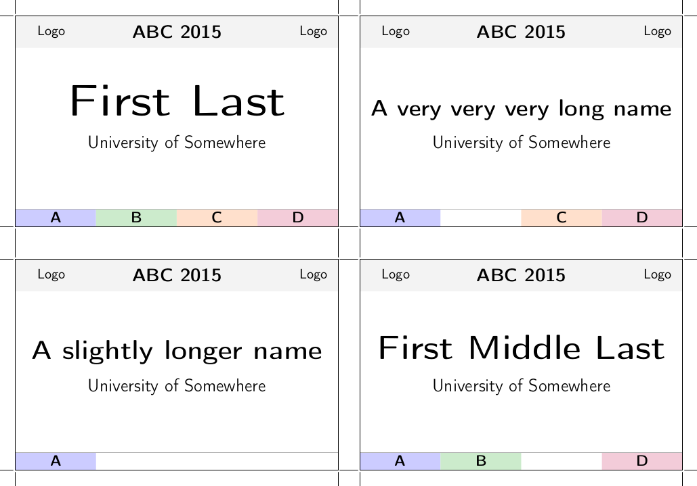

= badges.tex

`badges.tex` generates conference badges (name tags) automatically
from a csv file.  This saves a lot of work compared to manually typing
badges.

Another benefit is that this gives you the full power of the LaTeX
package https://en.wikipedia.org/wiki/PGF/TikZ[tikz] to control every
aspect in meticulous detail.

You will also notice that short names are printed very large while
longer names are printed smaller.  Because the average name is not
very long, this makes the name tags much more legible than printing
everything as tiny as required by the longest name.

To customize the appearence or content, see `badges.tex`.

== Example

